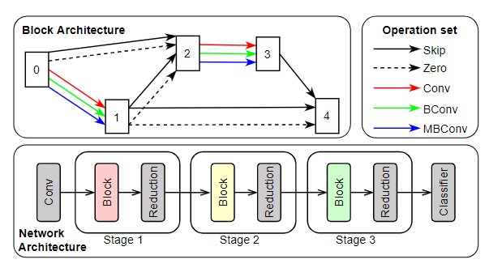
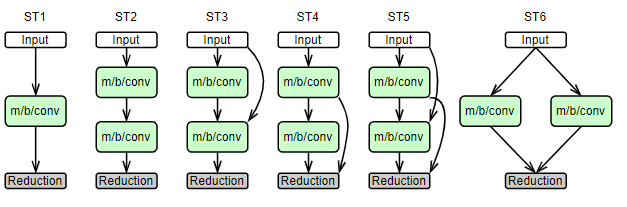
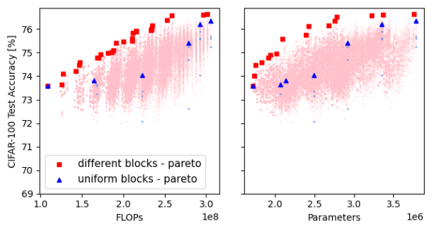

# Blox

> **NOTE!!!** Due to a bug discovered after we had already trained the first batch of 91,125 models, we decided to re-generate the dataset after the paper had already been submitted. 
> The bug was related to the construction of models from arch vectors - in short, it was making the first operation in each cell receive `x+x` as input rather than just `x`.
> We think that the decision to produce a bug-free dataset is clearly the right one, but unfortunately it also means that the exact numbers between the new dataset and our paper are different.
> We sincerely apologies for any confusion - please do not hesitate to contact us (e.g., by opening an issue) if you have any questions.
> We will also share the original dataset soon, for your reference.

## Introduction

This repository includes the code of Blox benchmark, presented in paper "BLOX: Macro Neural Architecture Search Benchmark and Algorithms".
Blox is a NAS benchmark for CNNs on macro search space. It consists of 91,125 networks and their accuracies, training time and environment, number of FLOPS and parameters, and inference latencies on CIFAR-100 dataset.

## Search Space

The network architecture consists of three stages, each containing a searchable block and a fixed reduction blocks. The searchable block can be expressed as a differentiable supernet as shown in the figure below.



To construct the macro search space, the block of each stage is allowed to be different. Operations are selected from 1) standard convolution, 2) bottleneck convolution, 3) inverted residual convolution. There are 6 connectivity schemes between operations as exemplified in the figure below. In total, there are 45 unique blocks, making the size of the search space 45^3 = 91,125.



## Statistics



## How to use

Note: please use `Python >= 3.6.0`.

You can type `pip install blox` to install our benchmark (optionally with the `-e` argument for in-place installation).
We recommend using Conda or some other virtual environment management tool to avoid problems with PyTorch versions.

### Training models
To train the models, type the following command:
```
# ./train_multi_gpu.sh <next_model_to_train> <models_per_gpu>
./train_multi_gpu.sh 0 50
```

### Generating dataset
After training finishes, the results in pickle format are stored under `exp` folder.

Then the following commands are used to generate the dataset

```
python tools/combine.py exp --output combined.pickle
python make_datasets.py
```

> **Note:** All accuracy values are saved up to 3 decimal places (where 1.000 == 1%), all loss values are saved with precision of 6 decimal places.

The dataset files are included in the GitHub's Releases page (check the column to the right) and are released in 3 format:
 - `".blox"` files are using a custom format optimised for both storage size and loading speed, although they require a C backend
   for efficient loading (shipped and installed together with the rest of the packege, see: `blox/_C/io_parse.c`)
 - `".pickle"` files are using standard `pickle` to (de)serialize data, loading is efficient but storage required is larger than for ".blox" files,
   further up side is that it does not require custom C code to load, but on the other hand can be considered unsafe in certain cases
 - `".csv"` files are widely supported and safe to load but are the least efficient


Any file constitutes a standalone dataset and can be used alone.
For example, if you're only interested in performing the very basic NAS and only need validation and final test accuracy, you might only download
the `blox-base-0.blox` file which is enough for that task.
Consequently, for full information you only need to download one set of files (with chosen extension).
You can also mix files with different extensions (for the details regarding how loading can be controlled, see the `preferred_ext` argument in the next section).

All extensions are designed to produce exactly the same values when parsed using provided functionality (`blox.io.read_dataset_file`).
You can validate this, and at the same time test loading time on your system, by downloading all files and running `tools/test_dataset.py`
(assumes all files are download to a `release` folder under the repo's root).
Expected output is something like:

```bash
Loaded file /home/lukasz/dev/blox/release/blox-info.blox in 0.39955759048461914 seconds...
Loaded file /home/lukasz/dev/blox/release/blox-env-0.blox in 0.1250152587890625 seconds...
Loaded file /home/lukasz/dev/blox/release/blox-base-0.blox in 1.0999469757080078 seconds...
Loaded file /home/lukasz/dev/blox/release/blox-ext-0.blox in 4.860059022903442 seconds...

Loaded file /home/lukasz/dev/blox/release/blox-info.csv in 2.8794748783111572 seconds...
Loaded file /home/lukasz/dev/blox/release/blox-env-0.csv in 0.45995283126831055 seconds...
Loaded file /home/lukasz/dev/blox/release/blox-base-0.csv in 4.916529178619385 seconds...
Loaded file /home/lukasz/dev/blox/release/blox-ext-0.csv in 18.744565725326538 seconds...

Loaded file /home/lukasz/dev/blox/release/blox-info.pickle in 2.3647303581237793 seconds...
Loaded file /home/lukasz/dev/blox/release/blox-env-0.pickle in 0.06459236145019531 seconds...
Loaded file /home/lukasz/dev/blox/release/blox-base-0.pickle in 3.2169032096862793 seconds...
Loaded file /home/lukasz/dev/blox/release/blox-ext-0.pickle in 4.198106288909912 seconds...

CSV: {'blox-info': True, 'blox-env-0': True, 'blox-base-0': True, 'blox-ext-0': True}
Custom: {'blox-info': True, 'blox-env-0': True, 'blox-base-0': True, 'blox-ext-0': True}
```

The last two lines indicate that all files match the reference data from pickle files.

### Using the dataset
The base dataset contains top1 validation accuracy for all epochs and the final test top1 accuracy, as well as the training time for each model.

```python
import blox

# Load the dataset
d = blox.from_folder('release')

# Model to query
arch_vec = [[[0], [1, 1, 1, 1]], [[1], [1, 1, 0, 0]], [[0], [0, 1, 1, 0]]]

# Obtain all information about the model
info = d.full_info(arch_vec)
# Top 1 validation accuracy
val_acc = d.val_acc(arch_vec)
# Top 1 test accuracy
test_acc = d.test_acc(arch_vec)
```

Optional arguments can be passed to obtain additional information of the dataset:
* `extended` includes loss (training, validation, test), top1 training accuracy for all epochs, and top5 accuracy for all epochs.
* `include_static_info` includes FLOPs, number of parameters, latency and architecture vector.
* `include_env_info` includes training environment for each model.
* `preferred_ext` controls the order of preference in which different extensions for the dataset files are loaded, see docstring for more info

```python
# include all info, prefer '.blox' files over '.csv', do not load pickle files (even if present)
d = blox.from_folder('release', extended=True, include_static_info=True, include_env_info=True, preferred_ext=['blox', 'csv'])
```

Please refer to `blox/dataset.py` for a full description of the API.

## Citation

If you find that Blox helps your research, please consider citing it:
```
@inproceedings{chau2022blox,
    title={{BLOX}: Macro Neural Architecture Search Benchmark and Algorithms},
    author={Thomas Chun Pong Chau and {\L}ukasz Dudziak and Hongkai Wen and Nicholas Lane and Mohamed S. Abdelfattah},
    booktitle={Thirty-sixth Conference on Neural Information Processing Systems},
    year={2022}
}
```

Shield: [![CC BY-NC 4.0][cc-by-nc-shield]][cc-by-nc]

This work is licensed under a
[Creative Commons Attribution-NonCommercial 4.0 International License][cc-by-nc].

[![CC BY-NC 4.0][cc-by-nc-image]][cc-by-nc]

[cc-by-nc]: http://creativecommons.org/licenses/by-nc/4.0/
[cc-by-nc-image]: https://i.creativecommons.org/l/by-nc/4.0/88x31.png
[cc-by-nc-shield]: https://img.shields.io/badge/License-CC%20BY--NC%204.0-lightgrey
